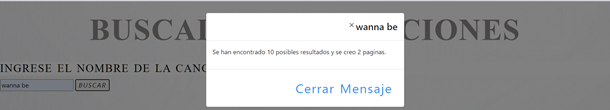

# Practica00-ConsumoDeAPIEnLaNube

#### Identificar gráficamente la arquitectura y el patrón de diseño de la aplicación a desarrollar

#### Generar una llave para consumir los servicios web de la API (opcional, depende de la API seleccionada).

#### Desarrollar una aplicación con HTML + CSS + Javascript + Web Services para buscar información y visualizar toda la información disponible a través de la API.

##### Para la parte de HTML
Se tiene un botón para la búsqueda del título de la canción que deseas encontrar, primero tienes que llenar el campo de texto con el nombre de la canción, y posterior dar click en el botón de búsqueda y se desplegaran la distinta información de cada una de las canciones con ese nombre. 

##### Para la parte de CSS

Se trabajo con el framework de Bootstrap, el cual es es una biblioteca multiplataforma o conjunto de herramientas de código abierto para diseño de sitios y aplicaciones, con esto nos permitirá tener una mejor experiencia de usuario. 

##### Para la parte de JavaScript 

Se trabajo con Ajax para la recopilación de la información de nuestra páginas web la cual nos devuelve en formato JSON, una vez que se obtiene la información se pasa a una tabla en la cual va a estar determinada por la Paginación que se realiza que es de 5 atributos por página. 

#### Enlace del repositorio en GitHub: 

Usuario de GitHub Juancarlos56
Repositorio de la Practica: https://github.com/Juancarlos56/Practica00-ConsumoDeAPIEnLaNube

#### Capturas de Pantalla del funcionamiento de la aplicación.

##### Interfaz grafica y sencilla para el usuario 

##### Una vez que se ingresa el nombre de la canción, la aplicación nos informa de cuantos resultados obtuvimos y en cuantas paginas nos a dividido. 

##### Una vez que se ingresa el nombre de la canción, se cambia el fondo de la pantalla y nos muestra los resultados. 

##### Se puede utilizar los botones para obtener más resultados

CONCLUSIONES: •	Se pudo identificar arquitecturas web utilizando servicios en la nube. Así como también, podrán consumir APIs y manipular objetos JSON.
•	Se logro identificar las diferentes arquitecturas Web para el desarrollo de aplicaciones y también como utilizar frameworks que nos facilita el trabajo en la parte estética.

##### Nombre de estudiante : Juan Carlos Barrera Barrera
